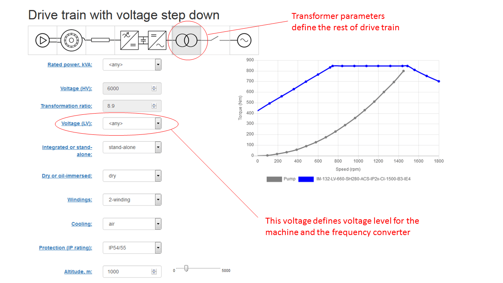
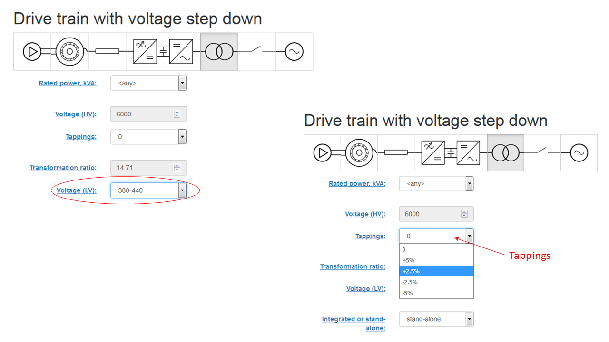
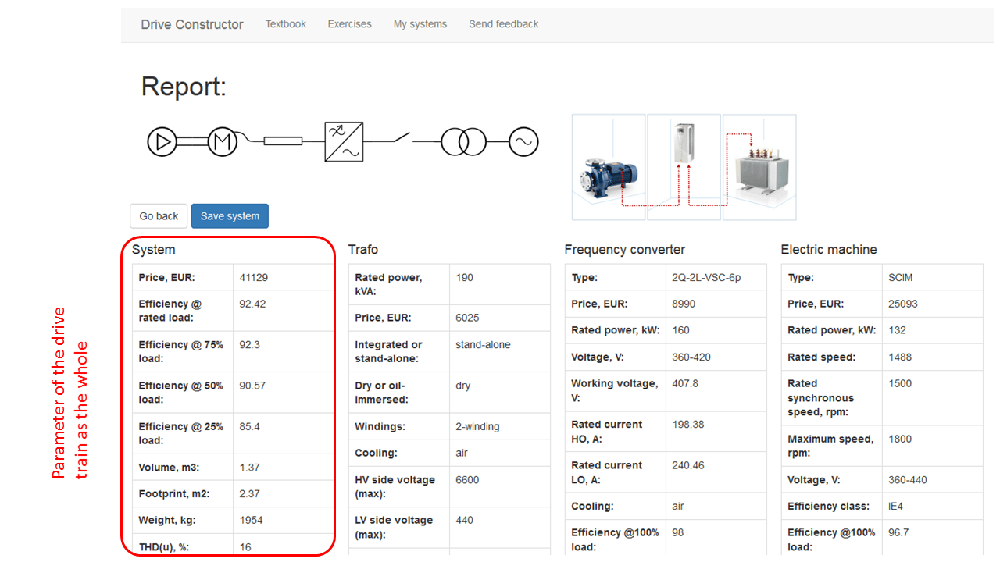
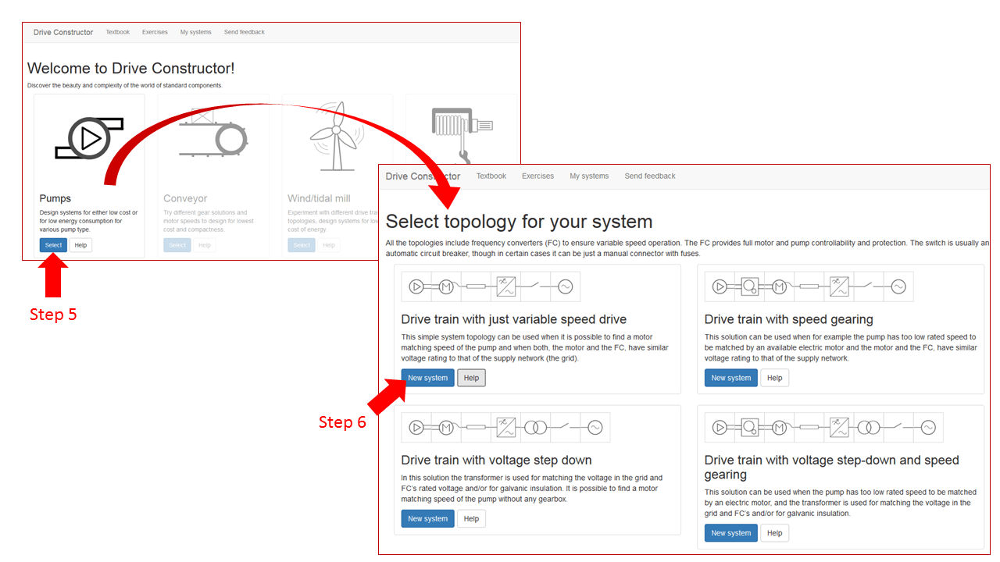
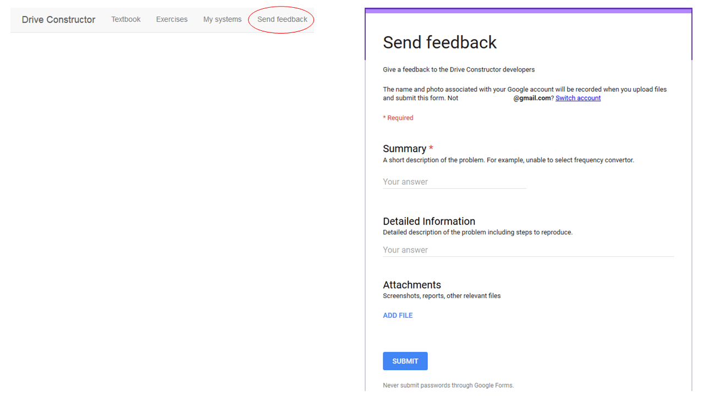

# Introduction

Here is the collection of 41 problems to solve. The problems are independent
from each other so in principle you can start from any of them. However, the
problems are grouped in a special way: the first 22 problems are focused on the
main system components - machines and converters - and the system behavior, and
then the remaining problems present the four application areas (pumps,
conveyors, turbines and winches/winders). So, is it recommended first to learn
more about the components and systems and then work with the applications.

To solve the problems you need to run _DriveConstructor_ and, if you are new to
this online course, use the Texbook.

# User's guide

### Main page

#### What is on the main page

Look through the textbook and the exercise book before you start.

For starting press "Select" button.

#### Tips

Right-click on the "Exercizes" menu and choose "Open Link in New Tab". Do the
same for "Textbook". Then you can have both software and the books available on
the three open pages in you browser.

### Page "Select topology for your system"

Select one of the four proposed topologies by pressing the respective "New
system" button. Only two topologies are taken as examples below. The ways of
working with all the topologies are identical.

### Page "Drive train with just variable speed drive"

The main principle of DriveConstructor is that the user sets up some parameters
of the components and the software chooses suitable component candidates from
catalogues and presents them to the user (the catalogues are not possible to see
in this version of DriveConstructor).

Sometimes the software proposes two candidates for some component. Then it is
necessary to choose one of them by checking the checkbox in the first column.

### Page "Drive train with voltage step down"

Transformer is a very important component taking the grid voltage down to the
level desired for the frequency converter and the machine.

By default the voltage on LV side of transformer is 650-700 V. You can choose
this to some other level as shown below. Transformer ratio recalculates
automatically. You can adjust the ratio by setting different "tappings".

When choosing types of frequency converter and winding type of transformer, make
sure lines on the icons match each other. Avoid situations where e.g.
transformer with 3-winding is connected to frequency converter destined for
2-winding transformer...

The first two topologies above are wrong and only the third one is correct!

Note that all parameters in "System" table of the report are for system as the
whole, meaning for example the price is sum of prices of all components, the
efficiency is product of efficiencies of all components, etc.

### Benchmarking of systems

When the report is generated as shown below, it is possible to save the system
(all system's parameters) in "My Systems" for comparison with other system
variants. Follow the following steps:

##### STEP 1. Press "Save system"

##### STEP 2. Choose some name for the system and press "Save system"

Then your system gets saved in "My systems" under the given name.

##### STEP 3. Open "My systems"

Here you can see key parameters of the saved system:

To benchmark systems one needs at least two of them. To set parameters of the
second system the user should go through the main page of DriveConstructor as
described in the next steps.

##### STEP 4. Press on "DriveConstructor" in the upper left corner

You come to the main page.

##### STEP 5. Choose the application you are working on ("Pumps" in our case)

##### STEP 6. Choose the system topology for the second system

##### STEP 7. Configure the system by setting all the parameters and save it in "My systems" the same way as you did for the first system

##### STEP 8. Open "My systems"

##### STEP 9. To benchmark the two systems, check both boxes under "Select" and press "Compare"

Then the graph appear as below:

Use feedback form for any comments, proposals and reporting problems to the
course developers

