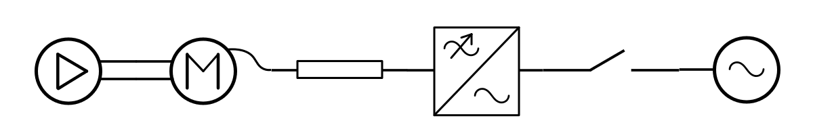
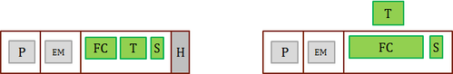
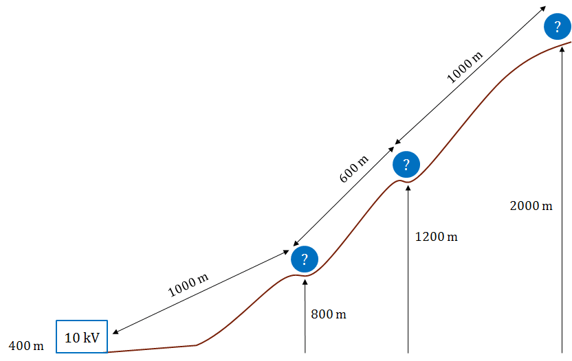

## P-1. Design for different pump types

Design drive system for the four pumps of the same power but of different types
and with different starting conditions

- Pump 1 - centrifugal pump
- Pump 2 - positive displacement pump
- Pump 3 - centrifugal pump with starting torque of 160%
- Pump 4 - positive displacement with starting torque of 220%

Given parameters:

- Rated flow 50 l/s, head 50 m, efficiency 81%, speed 200...950 rpm
- Grid voltage - 400 V
- Clean electric room for FC with abundant heat removal capabilities
- Distance from the electric room to the pump - 30 m
- Conditions at the place of the pump installation - wet
- Pump's mechanical configuration - horizontal

Design for the lowest cost. Try different motor types. Try different air cooling
types. Make conclusion on how type of the load curve (constant- or quadratic
torque) and high starting torque value affect the system component choice.

## P-2. Design for lowest system cost

Choose cheapest drive system for variable speed operation of the centrifugal
pump in water supply system.

Given parameters:

- Rated flow 50 l/s, head 200 m, pump efficiency 81%
- Speed range 0 - 1450 rpm
- Grid voltage - 400 V
- The pump works in its rated point
- Clean electric room for FC with abundant heat removal capabilities
- Distance from the electric room to the pump - 30 m
- Conditions at the place of the pump installation - wet
- Pump's mechanical configuration - horizontal

Sub-task: How would you design the system if we knew that normal working range
of the pump is 30-80%?

Sub-task for this and other exercizes: Try to find real motors and FC in
catalogues of provider from your region. e.g. Weg (for Brazil),
ABB/Siemens/Danfoss (Europe).

## P-3. Design for highest energy efficiency

Design drive system for variable speed operation of the centrifugal pump in
water supply system so that the system consumes minimum energy.

Given parameters:

- Rated flow 50 l/s, head 200 m, pump efficiency 81%
- Speed range 0 - 1450 rpm
- Grid voltage - 400 V
- Clean electric room for FC with abundant heat removal capabilities
- Distance from the electric room to the pump - 30 m
- Conditions at the place of the pump installation - wet
- Pump's mechanical configuration - horizontal

Load profile is given (table below). What is system efficiency at each load? How
much energy consumed per year? What is the cost of energy per year if 1 kWh
costs 0.2 Euro. What is the cost of the system consisting of motor, cable and
frequency converter?

| Time, % | 10  | 30  | 30  | 30  |
| ------- | --- | --- | --- | --- |
| Load, % | 25  | 50  | 75  | 100 |

## P-4. Design for lowest life cycle cost

Design drive system for variable speed operation of the centrifugal pump in
water supply system so that the system has lowest life cycle cost (LCC).

Given parameters:

- Rated flow 50 l/s, head 200 m, pump efficiency 81%
- Speed range 0 - 1450 rpm
- Grid voltage - 400 V
- Clean electric room for FC with abundant heat removal capabilities
- Distance from the electric room to the pump - 30 m
- Conditions at the place of the pump installation - wet
- Pump's mechanical configuration - horizontal
- Load profile is given (table)

Assume the pump works 24 hours a day. Energy price - 0,2 Euro/kWh Design for 3
different lifetimes: 1, 5 and 10 years.

| Time, % | 10  | 30  | 30  | 30  |
| ------- | --- | --- | --- | --- |
| Load, % | 25  | 50  | 75  | 100 |

## P-5. Design for constrained space

Design the container (put equipment into container of a given size). Design the
drive system and place its parts so that the configuration fits the heat removal
capacity of the containers. The centrifugal pump should be in a separate
compartment connected with the shaft to the motor which is in the compartment
next to the pump (shaft goes through the wall).

Given container size: H x L x W = 3 x 7 x 2 m. Note that the pump will occupy 1
m of the container length.

Try several variants with heat dissipation/removal capacity (in kW)
(ventilation/air-conditioning):

- 30 kW (cost 5000 Euro),
- 50 kW (cost 10000 Euro),
- 70 kW (cost 15000 Euro).

Consider using heat exchanger (air-to-water) to arrange water cooling of the
equipment inside the container.

Size of the heat exchanger: 0.6 x 1 m (footprint). Height is 2 m. Cost 20000
Euro.

Size of the switchgear, which should be placed in the container is 0.6 x 1 m
(footprint). Height is 2 m. Cost 10000 Euro.

Given parameters:

- Rated flow 250 l/s, head 200 m, pump efficiency 81%, speed 1450 rpm
- Voltage supplied to the container - 6000 V

 _Variants of placing the equipment._

## P-6.Design for special environmental conditions

Design drive system for pump installed on a 2 km high mountain. At the bottom at
the altitude of 400 m there is substation available with 10 kV supply. There are
opportunities to install available container at the slope at heights 800 m and
1200 m. Also near the pump at 2 km.

Propose two designs, lowest cost and highest efficiency. Compare solutions on
spider diagram.

Note: cost of 1 km 10 kV 100 A cable is 10000 euro.

Given pump parameters:

- Rated flow 50 l/s, head 200 m, efficiency 81%, speed 1450 rpm

 _Sketch of the landscape._
