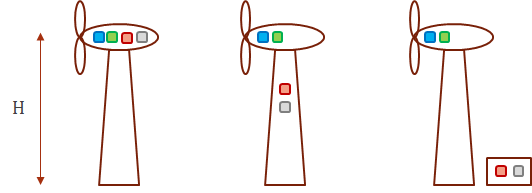
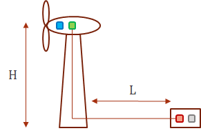

## WT-1.Top head mass reduction for floating wind turbines

Two imaginary companies, _OffshoreWinds Ltd_ and _WindFloaters Inc_ develop
offshore floating wind turbines of 1 and 2 MW size, respectively. Help them to
design power drive trains for their turbines. You are free to place converter
and transformer in the tower if you like. Available tower diameter is 4 m for
the 1 MW turbine and 7 m for the 2 MW turbine (remember space for the
elevator!).

Parameters of the turbines:

- Turbine by _OffshoreWinds Ltd_: Power 1 MW, rated speed 17 rpm.
- Turbine by _WindFloaters Inc_: Power 2 MW, rated speed 15 rpm.

Inter-park voltage is 11 kV.

What cables will you use? How about cable connection terminals? Bending of the
cable? Do you get some advantage if tower and nacelle are air-conditioned (no
salty air penetration)? What if clean cooling water is made available in the
nacelle/tower? What are other/additional design steps which cannot be tried in
DriveConstructor would you try? Input from the company: "we need lowest possible
top head mass as it would simplify design of the floating tower"

Note: We did not include direct drive option here as it is known to be the
heaviest.

Hints:

- Low-voltage electric machines in _DriveConstructor_ are available up to 2000
  kW, medium-voltage - up to 5 MW

## WT-2.Drive train optimization for on-land wind turbine

Design drive train for the series of WT;

- 500 kW (20 rpm, 238 kNm),
- 1 MW (17 rpm, 562 kNm), and
- 3 MW (15 rpm, 1910 kNm).

Overspeed is the same for all the turbines - 1.2. Grid voltage - 10000 V. Height
of the turbine is 100 m. The distance between the turbine foundation and the
power house is 200 m.

Design for lowest cost.

Try different electric machines and different gear ratios. Try different
variants with placement of the drive train components.

Assume enough space inside the tower to place the FC and the transformer (50 m
above the ground). Include variant with FC and transformer in a container on the
ground next to the WT (see the sketch below).

Assume cost of 1 m 10 kV cable is 10 euro. Assume cost of the container is 5000
euro.

Summarize and present all key results in a table.

## WT-3. Inertia of the drive train as protection against tidal turbine runaway

Consider the following situation: 1 MW TT tidal turbine (TT) is running at its
rated speed of 11 rpm (868 kNm).

There occurs grid loss, generator torque drops to zero, propeller begins to
accelerate. Brake will be applied in 0,1 sec (Case 1) or in 0,2 sec (Case 2).

Question: to what speed would the TT accelerate in Cases 1 and 2 if it had the
following drive trains configurations:

- without gear (DD),
- with 1-stage gearbox,
- with 2-stage gearbox,
- with 3-stage gearbox?

For all cases there is used PM machine as the generator.

Note: it is known that inertia of rotor of DD electric machine would be 17
$$ton*m^2$$

## WT-4. Cost of Energy (COE) analysis for ocean and river water stream turbines

Propose optimal drive train designs for one ocean and one river water stream
turbines of 1 MW power targeting lowest COE for each of the turbines.

Given for both turbines:

- Grid on-shore voltage - 6 kV
- Rated speed - 11 rpm
- Rated torque - 870 kNm
- Overspeed - 1.2
- Grid voltage on-shore - 10 kV
- Capital expenditures (CAPEX), except of the drive train cost - 7 million Euro.
- Operational expenditures (OPEX) - 0.4 million Euro per annum for drive train
  with 3-stage gearbox, 0.39 million Euro per annum for drive train with 2-stage
  gearbox
- Lifetime of the turbine - 20 years
- Cost of 10 kV subsea cable is 10000 Euro per km

Loads of the ocean turbine:

- Close to 100% load 10% of time
- Close to 75% load 35% of time
- Close to 50% load 30% of time
- Close to 25% load 25% of time

Load of the river turbine is assumed 100% all the time.

Try the two system solutions:

    - Solution 1. Frequency converter and transformer - on the shore.
    - Solution 2. Frequency converter and transformer in the nacelle.

Length of the cable between the river turbine and the on-shore grid is 0,5 km.

Length of the cable between the ocean turbine and the on-shore grid is 1 km
(case 1) and 3 km (case 2).

Present the COE values for all the cases you have analyzed. Compare the ocean
and the river turbines, draw conclusions.

## WT-5. Small high-speed WT

Given characteristics of the wind turbine:

- rated blade rotation speed - 200 rpm,
- rated torque - 1 kNm,
- turbine's height (H) - 30 m,
- grid/connected transformer with 400 V low-voltage winding is available in the
  powerhouse close to the turbine,
- distance from the turbine's tower to the powerhouse (L) - 50 m.

The task: design systems for the following drive trains configurations:

1. without gear (DD),
1. with 1-stage gearbox,
1. with 2-stage gearbox.

Design for highest efficiency at rated (100%) load. Limit system cost (capital
expenditures, CAPEX) to 20000 Euro. Keep in mind that different types of gear
stages you choose have different efficiency. Try different cable materials and
cross-sections. Draw conclusions on efficiency vs cost for each of the three
system variants. Which system is the most efficient and is still under 20000
Euro in cost? Which system is the lightest? Which is the cheapest? First take
induction machine (SCIM) and try different efficiency classes, then try SyRM and
PMSM.

