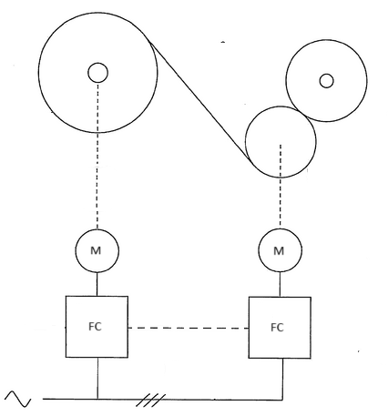
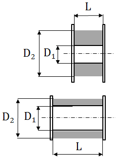

## W-1. Drive train for the winder

Design drive train for the winder with the following data:

- empty drum diameter 0.2 m
- full drum diameter 0.3 m
- linear speed at which the cable is to be reeled on the drum - 5 m/s
- force/tension on the cable 10 kN
- grid voltage 400 V
- no overloads

Design the drive system for lowest cost. Consider topologies with gearbox and
direct drive.

## W-2.Designing the winch drum and drive train for low cost

Design the winch drum and drive train for the following system specification:

- linear speed at which the cable is to be reeled on the drum 2 m/s
- force/tension on the cable 10 kN
- overloads - 20 %
- grid voltage 690 V
- capacity of the winch - 1 m3

Design drum by varying:

- empty drum diameter (D1)
- full drum diameter (D2)
- drum length (L)

Optimize for lowest drive train cost. Assume cost of the drum negligible.

## W-3. Inertia in the winch drive train

The trawler is going forward dragging a fish net behind. The net is connected by
a wire to the winch. The winch drum is being held at zero speed by torque
control. Rated torque is applied. Sometimes the net may get stuck and the wire
collapse.

Given data (normal operation):

- Empty drum diameter 1 m
- Full drum diameter 1.5 m
- Linear speed at which the cable is to be reeled on the drum 2 m/s
- Force/tension on the cable 100 kN
- Overloads - 50 %
- Vessel grid voltage 690 V

Typical situation is given:

- Speed of the vessel - 5 m/s
- Wire elasticity - 1% (how much it can extend in % before collapsing)
- Wire length 1 km
- Inertia of the drum - 100 kgm2
- Torque is removed by control system 1 second after the net stuck detection.
- Force on the wire (and torque) increases by 20% right after the net stuck and
  them increases by 10% for every 0.1% of extension of the wire.

Design drive train so that the wire does not collapse. To find the answer try to
dimension the drive train using several gearbox and machine combinations. Check
if the wire would collapse in each design variant.
