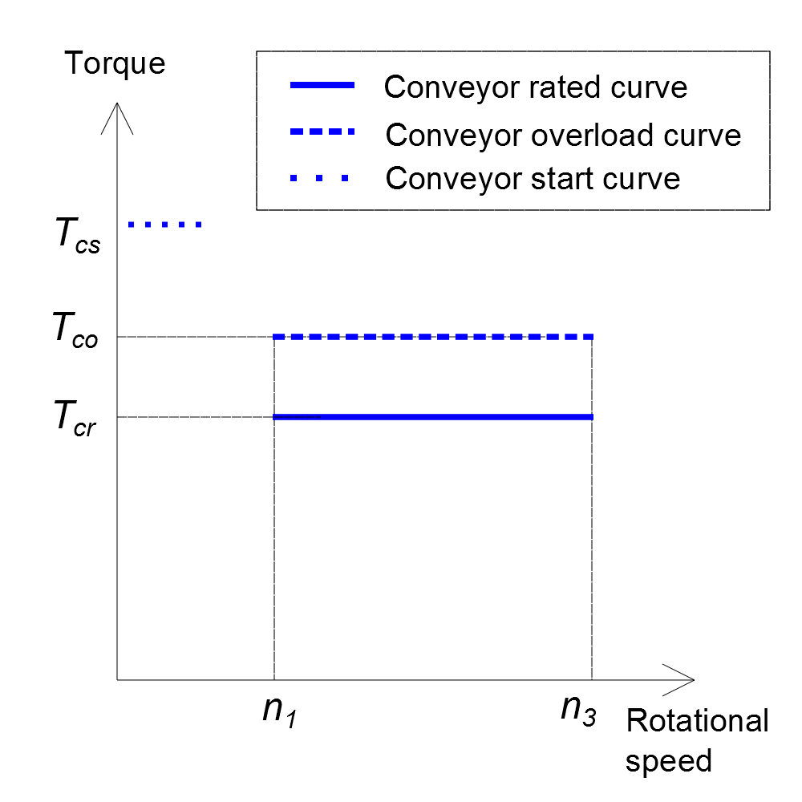

In _DriveConstructor_ we operate with the type of curves shown in Fig.1. We
assume torque is constant in the given speed range. Short-term overload can be
specified. Also very short-term overloads for starting the conveyor (breakaway
torque) can be specified.

*Fig.1.*

So, one needs to specify:

- minimum and maximum rotational speed of the conveyor drum,
- rated torque,
- overload torque,
- starting (breakaway) torque, and
- conveyor duty
