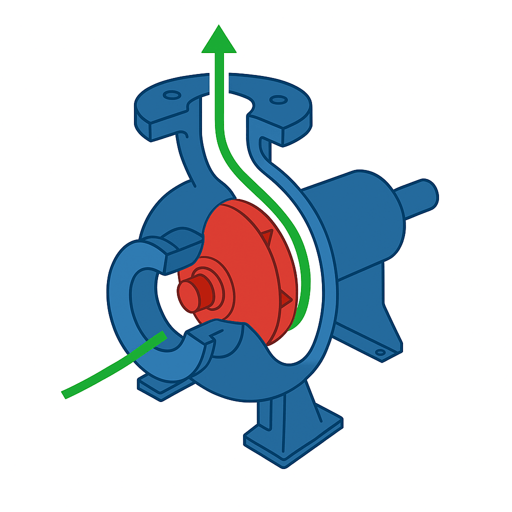
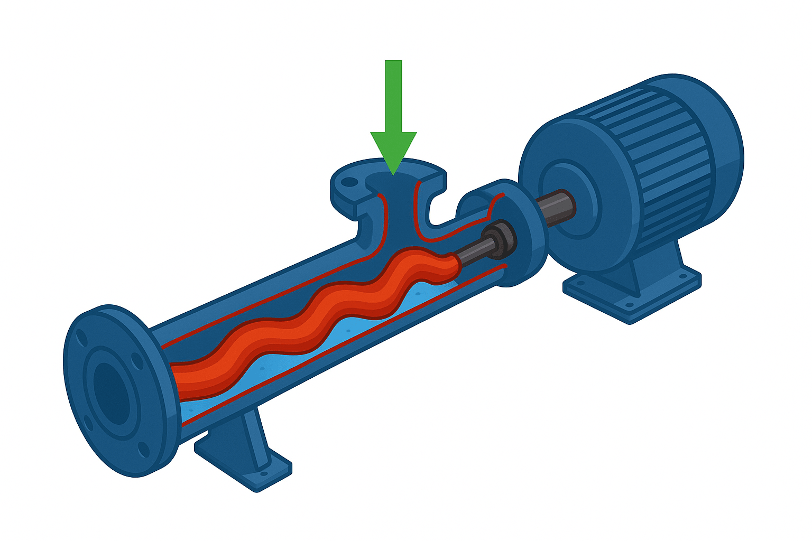

## General description

A pump can be specified by its type and the set of hydrodynamic parameters;
rated speed, head, flow, efficiency and density of the fluid it pumps. However,
what dimensions the drive system is torque on shaft of the pump and the shaft's
rated speed as well how the torque changes with the changing speed.

To configure the drive train for a pump DriveConstructor uses four parameters:

1. Required rated torque on the shaft of the pump
2. Rated rotational speed of the pump's shaft
   - variable speed drive allows changing speed the pump operates at, however, a
     pump is designed for some definite rated speed usually given for any pump
     in the respective brochure or catalogue
3. Load curve of the pump
4. Starting torque of the pump

The load curve and starting torque of the pump depend on the pump's type. There
exist many different types of pumps. The most common - centrifugal pump - is
presented in Fig.1. Another example - progressive cavity pump - is presented in
Fig.2.

_Fig.1. Centrifugal pump._

_Fig.2. Progressing cavity pump with a motor._

Rated rotational speed of the pump's shaft is given for any pump in the
respective brochure or catalogue.

### Rated torque

Rated torque is calculated from the power and the speed:

$$T = (9.55*P)/n$$,

where $$n$$ is speed in rpm, $$P$$ is power in kW and $$T$$ is torque in kNm.

The power can be calculated from pump parameters such as head, flow, efficiency
and density of pumped fluid:

$$P=(g*\rho*h*q)/(3.6*10^6*\eta)$$,

where $$P$$ is in kW, $$g$$ is gravity ($$g=9.81$$ $$m/s^2$$), $$\rho$$ is
density of the pumped fluid in $$kg/m^3$$, $$\eta$$ is efficiency of the pump,
$$h$$ is head in m and $$q$$ is flow in $$m^3/h$$.

Note that in practice a pump can work at heads and flows lower than the rated
ones for which it is designed. Speed and efficiency can then be different from
the rated ones as well. So, remember to enter actual head, flow, speed and
efficiency.
