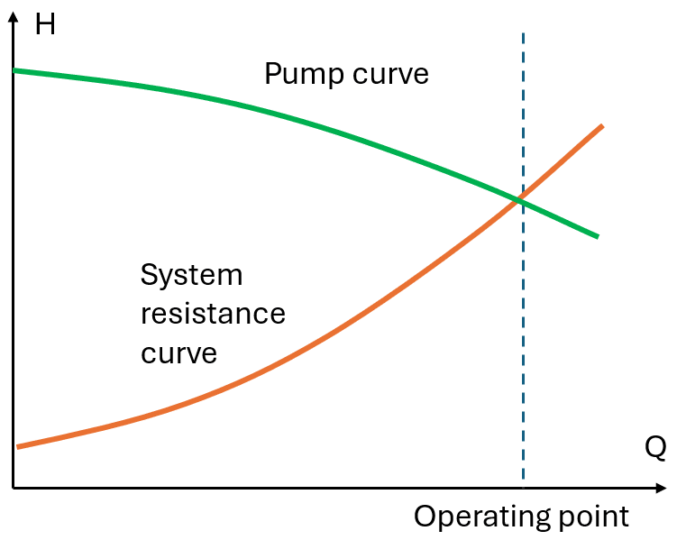
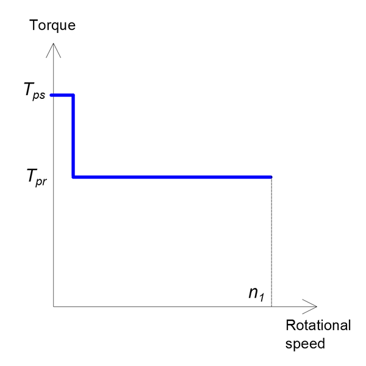
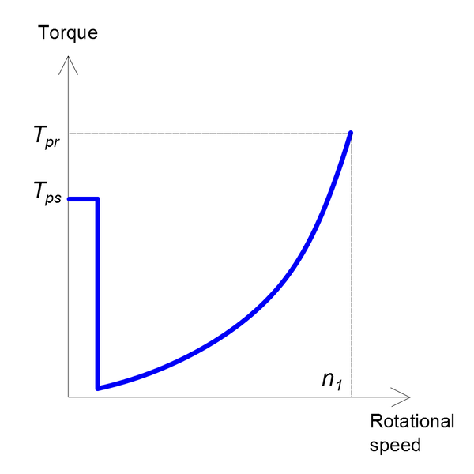

## Head and flow

Rated head and flow are the key characteristic of any pump and is always
specified by the pump manufacturer.

The static Head (H) of a pump is the maximum pressure it can deliver (height to
which the pump lifts the liquid). In DriveConstructor this parameter is entered
in m.

Flow (Q), also referred to as volume flow rate or capacity, is the volume of
liquid that travels through the pump in a given time (measured in liter per
second of cubic meter per hour). Rated flow is the key characteristic of any
pump and is always specified by the pump manufacturer. In DriveConstructor this
parameter is entered in $$m^3/h$$ or $$l/s$$.

_Fig.1. Centrifugal pump and system resistance curves._

| Fluid                 | Density, kg/m3 |
| --------------------- | -------------- |
| water                 | 1000           |
| average oil           | 920            |
| kerosene              | 820            |
| milk                  | 1035           |
| average oil sea water | 1025           |
| gasoline              | 720            |

### Starting torque ("breakaway" torque)

Real pumps can have a significant static friction or breakaway torque (as shown
in Fig. 2, 3), which must be overcome when starting. In some cituations starting
torque can be higher than the rated torque even for centrifugal pumps.

*Fig.2. Pump with CT load curve and starting curve.*

*Fig.3. Pump with QT load curve and starting curve.*

In _DriveConstructor_ starting torque is defined as the fraction of rated torque
$$T_r$$. The following values can be chosen: 0.0, 0.1, 0.2, 0.3, ..., 1.8,
1.9, 2.
