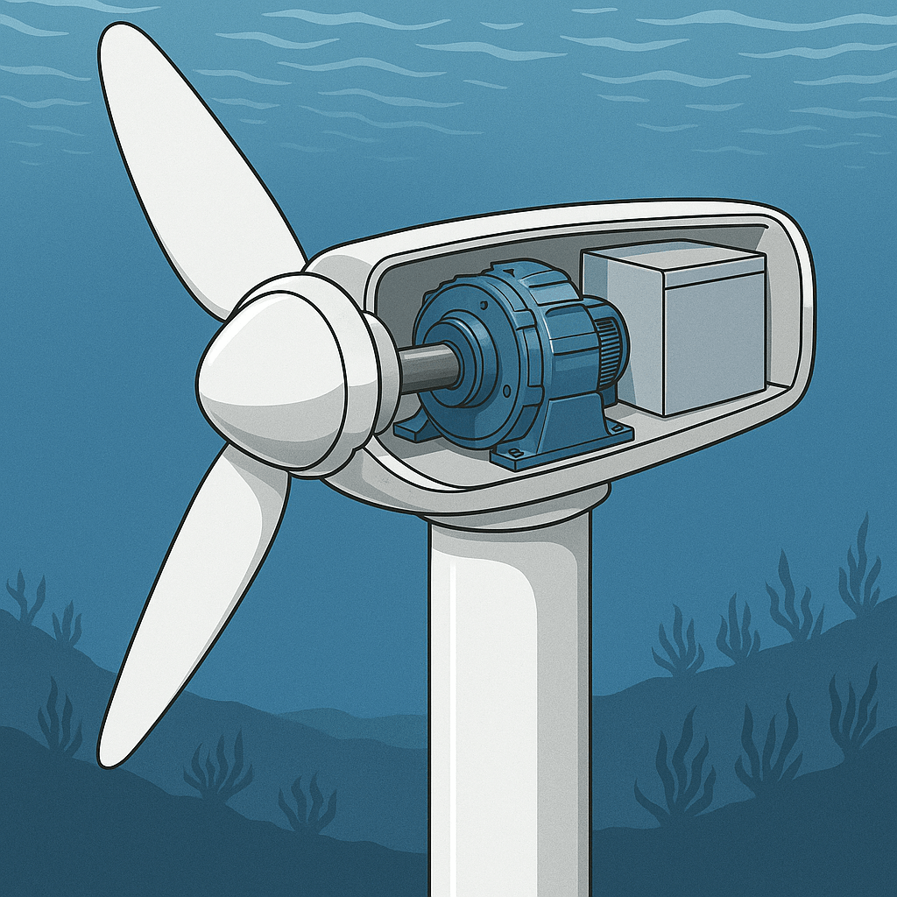

Drive train of wind or tidal turbine in most cases include a gearbox and a
generator (Fig.1). The gearbox and the generator can be mechanically integrated.
Direct drives are usually bulky and heavy. There are, though, special designs
usually based on integration with the turbine structure, in order to reduce
weight.

_Fig.1. Wind turbine with a gearbox and a generator._

The nacelle of a wind or a tidal turbine can contain not only the gearbox and
the generator, but also other equipment (Fig. 2-3), like frequency converter and
transformer.

*Fig.2. Equipment in the nacelle.*

*Fig.3. Tidal turbine.*

### Load characteristics

There is theoretical maximum power which is possible to extract following the
maximum torque curve shown in Fig. 3-4. It can be seen that generator speed
increases in Region II and is kept almost constant in Region III.

*Fig.4. Generator speed vs torque.*

*Fig.5. Wind speed vs turbine speed and power.*

There should be kept some safety torque margin (between $$n_1$$ and $$n_2$$ in
Fig.6) due to possible wind gusts.

*Fig.6. Turbine load torque curve.*

### Parameters of wind (or tidal) turbine

    - Rated speed of the propeller (above this speed maximum energy is extracted)
    - "Cut off" speed, which is maximum allowed speed (turbine and generator are not run above this speed)
    - Rated torque (at this torque maximum energy is extracted)
    - Extra torque (torque margin) is needed to prevent runaway of the turbine in case of wind gusts and very strong wind in general.
