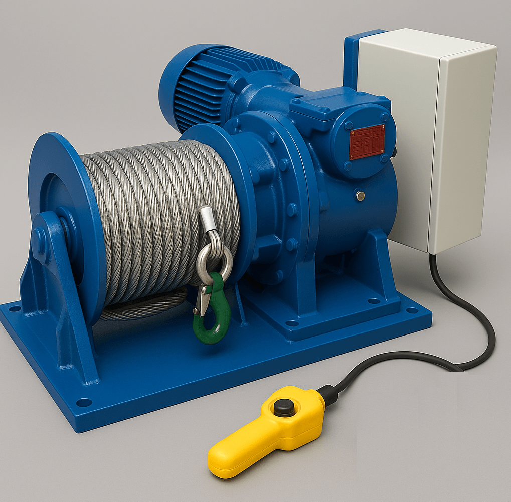
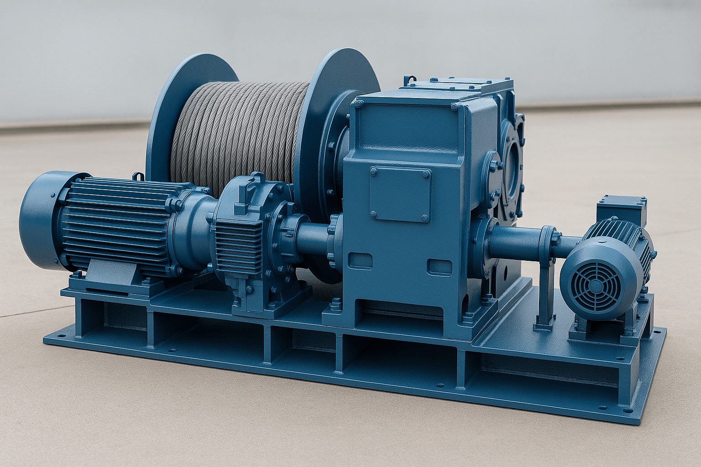
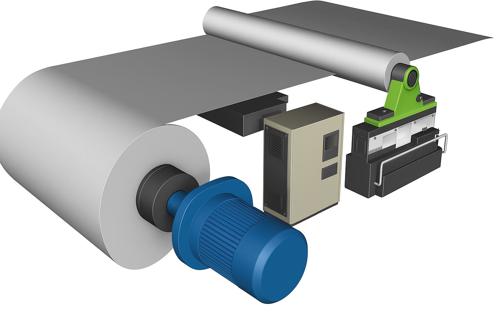
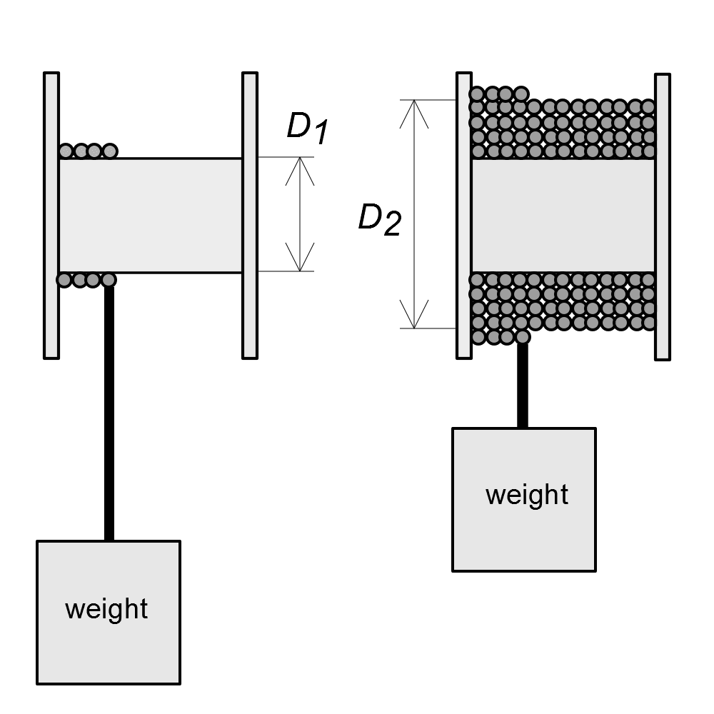
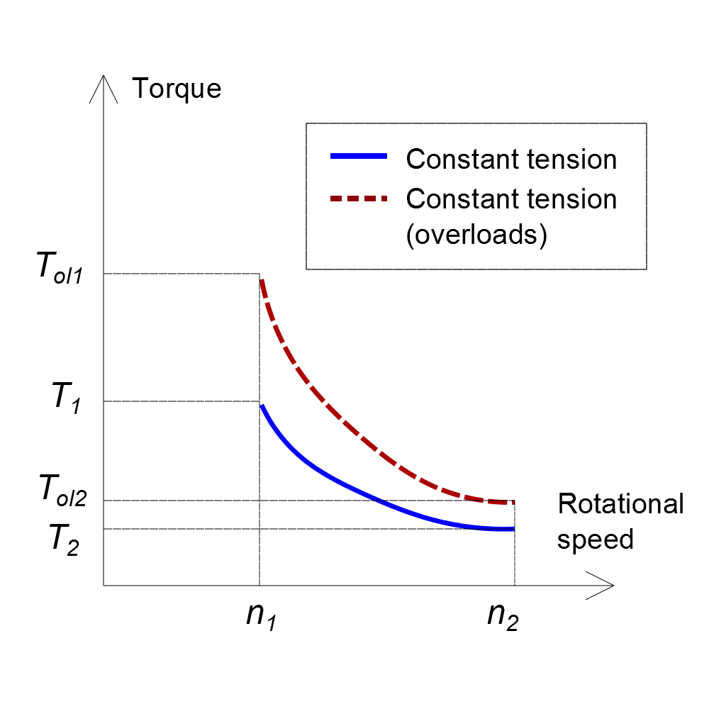

In _DriveConstructor_ two types of mechanisms are united under the same
"application" class; these mechanisms are winches (Fig. 1-2) and winders (Fig.
3).

 _Fig.1. Winch example._

 _Fig.2. Winch example 2._

 _Fig.3. Winder example._

The winches and winders are characterized by the special shape of load curves.
The specifics is in changing diameter of the surface on which the material is
coiled on. The two extreme states are shown in Fig.4:

- drum without anything coiled/wound on it ($$D_1$$)
- last layer of rope or whatever coiled/wound on the drum when there is no more
  space on it ($$D_2$$)

 _Fig.4. Dimensions._

 _Fig.5. Load curves._

When the coiling/uncoiling (winding/unwinding) takes place (between the two
extreme states) the speed and the torque change in the opposite way. When linear
speed and tension are kept constant, then the rated torque curve is like the
blue curve in Fig. 5. Possible overloads are presented as the dashed red curve.

#### Parameters of winches and winders

- Diameter [m] of the drum without anything coiled/wound on it.
- Diameter [m] of the last layer of rope or whatever coiled/wound on the drum
  when there is no more space on it.
- Rated linear force (tension) [kN] on the line/wire/string/fabric/paper/foil or
  whatever else is being coiled/wound on the drum.
- Rated linear speed [m/s] of the line/wire/string/fabric/paper or whatever else
  is being coiled/wound on the drum.
- Expected overload torque as multiple of the rated torque.
