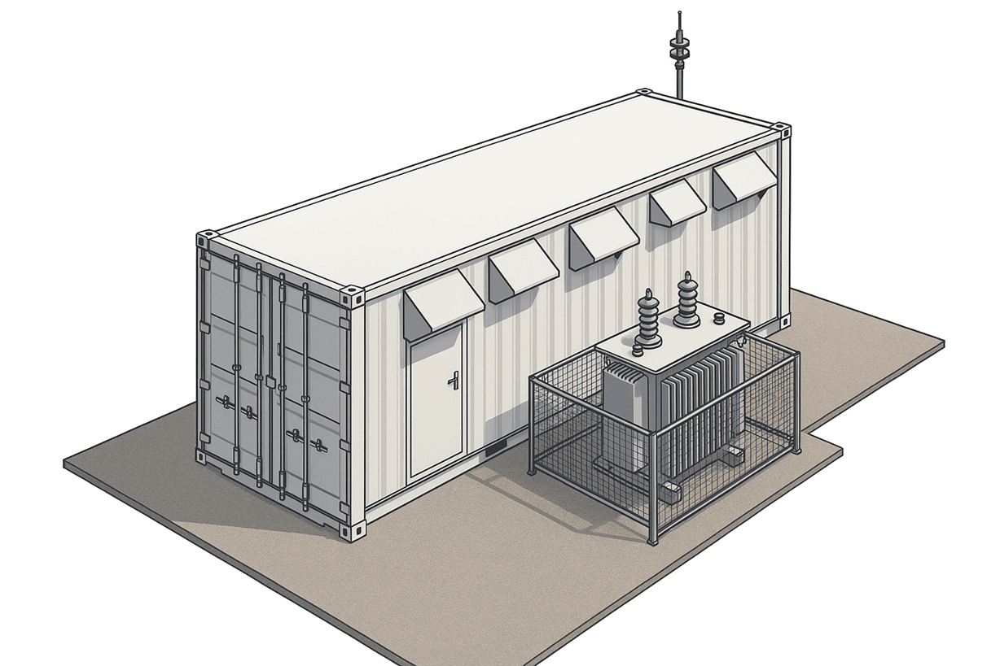

When the component is expected to work at high ambient temperatures de-rating
factors should be applied when choosing rating of the machine. Different
equipment providers give slightly different derating factors. Some variants are
presented in the tables 1 and 2. In _DriveConstructor_ derating is done
automatically when the user sets the ambient- or the coolant temperature for the
components.

#### Ambient temperature

As the cable between the machine and the converter can be long (in special cases
up to several km!) the environment can be quite different for the machine and
the converter, as well as for other components of the system. The machine for
example can be at the open air while the converter in a dry electric room with
air conditioning or a container (Fig.1).

 _Fig.1. Container example._

The coefficient of power derating with ambient temperature $$k_a$$ is defined as
permissible output in % of rated output as function of ambient temperature
$$T_a$$.

_Table 1. Air-cooled components. Power derating $$k_a$$ as function of ambient
temperature_.

| $$T_a ^\circ C$$ | Electric machine & Transformer | Frequency converter |
| ---------------- | ------------------------------ | ------------------- |
| 30               | 108%                           | 102%                |
| 35               | 104%                           | 100%                |
| 40               | 100%                           | 98%                 |
| 45               | 96%                            | 92%                 |
| 50               | 92%                            | 84%                 |

When the component needs to be de-rated for both temperature and altitude, the
de-rating factors given in the table should be multiplied together.

#### Coolant temperature

Temperature of the cooling water at the input of the component cooling circuit.
In _DriveConstructor_ it can be varied in the range 20...50 $$^\circ C$$ for EM,
FC and transformers. The coefficient of power derating with coolant temperature
$$k_w$$ is defined as permissible output in % of rated output as function of
coolant temperature $$T_w$$.

_Table 2. Water-cooled components. Power derating $$k_w$$ as function of coolant
temperature_.

| $$T_c ^\circ C$$ | Electric machine | Frequency converter | Transformer |
| ---------------- | ---------------- | ------------------- | ----------- |
| 20               | 110%             | 105%                | 105%        |
| 30               | 108%             | 104%                | 104%        |
| 35               | 104%             | 100%                | 100%        |
| 40               | 100%             | 92%                 | 100%        |
| 45               | 96%              | 84%                 | 96%         |
| 50               | 92%              | 76%                 | 92%         |

When a component, like liquid-cooled FC, has both air- and water-cooled parts,
derating should be calculated for both parts of the respective ambient- and
coolant temperatures. In addition derating for altitude (if needed) should be
implemented. Smallest of the products $$k_h*k_a$$ and $$k_h*k_w$$ should be
taken as the overall overload. For example if $$k_h$$=90% and $$k_a$$=80%, the
product $$k_h*k_a$$ is 0.9\*0.8=0.72 or 72%.

Temperature of the coolant may help to solve the high-altitude problem. It is
possible to compensate high altitude with lower temperature of the coolant.

There is also PWM frequency derating, though this functionality is not included
in _DriveConstructor_.
