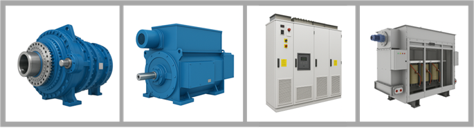

DriveConstructor includes the following components:

- [Electric machines](/docs/textbook/components/electric-machines)
- [Frequency converter](/docs/textbook/components/frequency-converters)
- [Gearboxes](/docs/textbook/components/gearboxes)
- [Transformers](/docs/textbook/components/transformers)

