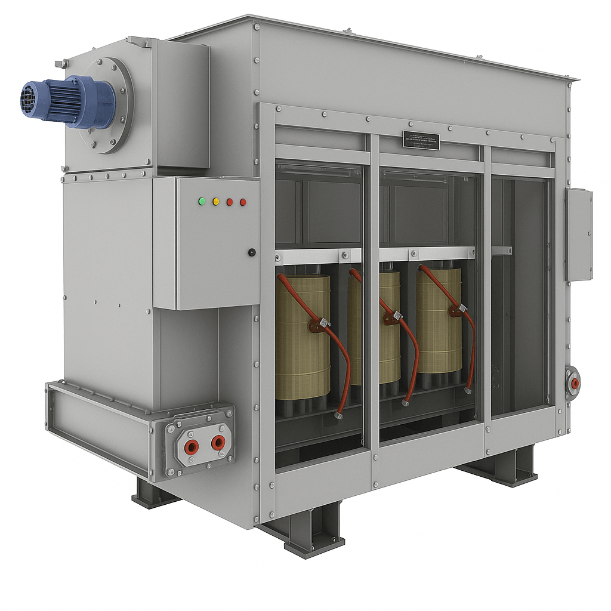

ABB claims that only small frequency converters (FC) can be connected to an LV
network without a transformer due to harmonics and EMC requirements. The
different FC types are quite diverse in the amount of produced harmonics and so
are the networks in their sensitivity. The decision whether to use an individual
supply transformer or not must be made case by case.

_Fig.1. Transformer example._

The supply transformer placed between the grid and the FC covers several
different tasks:

- Galvanic isolation between the frequency converter and the feeding network.
- Voltage reduction from the feeding MV or HV network to the FC input level.
- Suppression of harmonics generated by the frequency converter, thus protecting
  the feeding network from harmonic contamination.
- Protection of ambient and the feeding network against radio-frequency
  interference produced by the rapidly commutating semiconductors.

Harmonic frequencies increase the mechanical and dielectric stresses and
therefore the supply transformers must be specially designed for this duty.

---

## Power, voltages and transformation ratio

### Rated power

For transformer ratings under 10 MVA, IEC 60076-1 suggest preferred values based
on the R10 series: 10, 12.5, 16, 20, 25, 31.5, 40, 50, 63, 80, 100, and
multiples of 10n. For example, the preferred transformer sizes from 500 kVA to
4000 kVA are: 500, 630, 800, 1000, 1250, 1600, 2000, 2500, 3150, 4000.

### Voltages at higher voltage (HV) side and lower voltage (LV) side

ABB claims that the VSD supply transformer is usually fed by a medium voltage
network, but sometimes the transformer primary voltage may be at the LV level.
Feeding from an HV network is also possible but rare. The input voltages in MV
drives are from 1 kV to 36 kV. The input voltages in LV drives are usually
between 380 V and 900 V, depending on the drive type".

In _DriveConstructor_ it is possible to choose not exact values but ranges of
values.

##### Voltage (HV)

The ranges can be chosen from the following: 2200-2500, 2500-2800, 2800-3200,
3200-3400, 3400-4100, 4100-4300, 4300-5800, 5800-6800, 6800-9000, 9000-12000 V.
Choose range which fits grid voltage. Default setting is "any".

##### Voltage (LV)

The ranges can be chosen from the following: 380-440, 650-700, 2400-2500,
2900-3100, 3200-3400, 4100-4200, 5900-6700 V. Choose range which fits FC
voltage. Default setting is "any".

### Transformation ratio

In _DriveConstructor_ the ratio is defined by the ranges chosen for the grid
side (MaxHV-MinHV) and FC side (MaxLV-MinLV) and the additional adjustments made
manually (see the software). The range of ratios is:

- minimum ratio is calculated as MaxHV/MinLV,
- maximum ratio is calculated as MinHV/MaxLV.

Then the ratio can be "manually" adjusted within the range between minimum and
maximum values.

---

## Types of transformers

### Dry or liquid-filled

Basically, there are two distinct types of transformers: Liquid insulated and
cooled (liquid-filled type) and non-liquid insulated, air or air/gas cooled (dry
type) - see Fig. 2 and 3. Also, there are subcategories of each main type.

Liquid-filled transformers (also called oil-immersed) are normally more
efficient than dry-types, and they usually have a longer life expectancy. Also,
liquid is a more efficient cooling medium in reducing hot spot temperatures in
the coils. In addition, liquid-filled units have a better overload capability.
There are some drawbacks, however. For example, fire prevention is more
important with liquid-type units because of the use of a liquid cooling medium
that may catch fire. (Dry-type transformers can catch fire, too.) It's even
possible for an improperly protected wet-type transformer to explode. And,
depending on the application, liquid-filled transformers may require a
containment trough for protection against possible leaks of the fluid.

_Fig.2. Dry transformer (without enclosure)._

_Fig.3. Oil-filled transformer._

Arguably, when choosing transformers, the changeover point between dry-types and
wet-types is between 500 kVA to about 2.5 MVA, with dry-types used for the lower
ratings and wet-types for the higher ratings.

Important factors when choosing what type to use include where the transformer
will be installed, such as inside an office building or outside, servicing an
industrial load.

Dry-type transformers with ratings exceeding 5 MVA are available, but the vast
majority of the higher-capacity transformers are liquid-filled. For outdoor
applications, wet-type transformers are the predominate choice.

### Windings

Ordinary transformers have two windings; one primary and one secondary. However,
there exist three- or four-winding transformers. ABB says: "The rectifiers used
in low voltage VSDs are usually both 6-pulse or 12-pulse rectifiers, and they
may be diode bridges, thyristor bridges or power transistor solutions. The
6-pulse rectifier is supplied by a two-winding transformer and the 12-pulse
rectifier needs a three-winding transformer, having two separate secondary
windings with 30$$\degree$$ phase shift."

Special converters requiring multiple inputs call for multi-winding
transformers.

In _DriveConstructor_ there are the following options: "2-winding", "3-winding",
"multi-winding".

### Cooling type

Where the dissipation of heat is an important factor, the possibility to cool
the electrical apparatus with water allows better management with the cooling
system.

### Integrated or stand-alone

Transformer can be integrated with the frequency converter or be mechanically
separated, the latter variant called "stand-alone". Integrated designs are not
common. Integration means usually sharing cooling system (heat exchanger,
cooling ducts, water piping).

---

More information can be found
[here](http://electrical-engineering-portal.com/right-choice-of-dry-type-or-liquid-filled-transformer).
