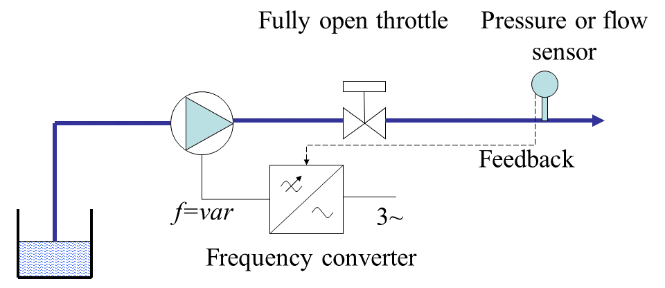

More than 80% of the world's population of electric motors drive the mechanisms
with a quadratic load characteristic - pumps, fans and compressors. Centrifugal
pumps, being probably the most popular pump type, are used almost everywhere -
nearly in all industries and utilities. Operation of centrifugal pump at
variable speed usually demonstrate impressive energy savings compared to
constant speed operation. The way of achieving the savings can be demonstrated
for a basic water supply system shown in Fig. 1.

_Fig. 1. Water supply with throttle regulation_.

The height of the pump axis above the level of the water reservoir ("lift
height") is called the static head $$H_st$$. When rotational speed of the
impeller of the pump is not regulated, a throttle (valve) is installed at the
pump outlet, which can change area (cross-section) of the water passage to
regulate the volume of the water supplied to the hydraulic network and the
pressure in the network. The characteristic of the pump is determined in the
coordinates of the head-flow _H-Q_. With the throttle fully open (Fig. 2a), the
head and the flow are nominal (100%) and the pump's operating point is at the
intersection of its own characteristic and the hydraulic network's (system's)
characteristic. If it is required to set the flow below $$Q_nom$$, the throttle
partially closes and the characteristic of the hydraulic network shifts upwards
(Fig. 2b). Accordingly, the operating point moves from "1" to "2". The new flow
rate (_Q = 82%_) corresponds to a new head (_H = 64%_) in the network after the
throttle, which is defined as the head difference at point "2" and the head drop
_$$\Delta$$H_:

$$H_t=H_2-\Delta H_t=108\%-44\%=64\%$$.

The disadvantage of the flow and head regulation by the throttle (called
"throttling") is the energy loss at the throttle. The graphically useful energy
and the energy lost on the latch can be represented by rectangles in Fig. 2c. It
can be seen that even with not deep regulation of the pump flow (Q = 82% of the
nominal value), the throttle losses make up more than 40% of the power.

Another problem of throttling is reduced efficiency of the pump when the pump's
operating point is shifted from the rated due to the change in the performance
of the hydraulic network (the throttle is part of the network).

 _(a)_

 _(b)_

 _(c)_

_Fig. 2. Throttle control_.

The power on the pump shaft is determined by the following expression:

$$P=(g * \rho * h * q)/(3.6 * 10^6 * \eta)$$,

where _P_ is in _kW_, _g_ is _gravity_ ( $$g = 9.81$$ $$m/s^2$$ ), $$\rho$$ is
_density_ of the pumped fluid in $$kg / m^3$$, $$\eta$$ is _efficiency_ of the
pump, _h_ is _head_ in _m_ and _q_ is _flow_ in $$m^3 / h$$.

Thus, lower efficiency of the pump lead to increase power consumption. Fig. 3
shows the efficiency map of the pump (lines of equal efficiency).

_Fig. 3. Pump efficiency_.

When adding the frequency converter to the motor driving the pump, the throttle
can be permanently set to the fully open position. Head and flow control is
performed by changing the rotational speed of the pump's impeller. Typically, a
system with pump speed control operates in a closed loop on the feedback signal
from the pressure sensor (Fig. 4).

_Fig. 4. Water supply FC control_.

When the pressure in the network drops below by a value set by the operator,
which indicates an insufficient flow, the inverter automatically increases the
pump speed, which increases the flow rate and the pressure. Likewise, when the
pressure rises above a preset value, the flow rate needs to be reduced - this is
done by reducing the pump's speed.

 _(a)_

 _(b)_

 _(c)_

_Fig. 5. Impeller speed regulation_.

In contrast to the throttle control, when the displacement of the operating
point during regulation was effected by changing the characteristics of the
hydraulic network (the throttle is part of the network), in the event of a
change in the speed of rotation of the impeller, the pump characteristic _H-Q_
is shifted. Fig. 5a shows the displacement of the characteristics of the pump,
and the operating point of the process with a decrease in speed from _n_ to 82%
of _n_. Since the valve is fully open, there is no loss on it and all the
hydraulic energy generated by the pump is useful (Fig. 5b). It is noteworthy
that when the pump speed is regulated and the corresponding displacement of its
characteristic, the operating point is constantly in the zone of maximum
efficiency (Fig. 5c).
