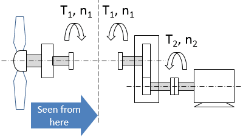

All moving (rotating) parts of a drive train are characterized with their own
inertia. There can be calculated a combined inertia of several mechanically
connected parts - for example _"rotor + coupling + driven mechanism"_. To
calculate combined inertia of the drive train without gearboxes inertias of the
drive train's parts are simply summed up. A gearbox changes the inertia in the
system and, from the operation point of view the gearbox may play both a
positive and a negative role. Possible system level considerations are presented
below with the help of the four cases related to operation of a tidal turbine
and a winch. The drive trains in the four cases include a gearbox, an electric
machine and a brake (Fig.1).

 _(a)_

 _(b)_

_Fig. 1. Mechanical drive trains for a tidal turbine (a) and a winch (b)_.

### Case 1. Critical acceleration of a tidal turbine at grid loss

In case of grid loss the turbine should be braked. Before the mechanical brake
is applied, the propeller will accelerate extremely fast if the system inertia
is low. When analyzing the inertia in a system with a gearbox one could divide
the train into two "parts" or "sides": the "first" - where the force of the
water stream is applied, and the "second" - which is counteracting the force.
The gearbox usually belongs to the "second" side. Since in our case the action
is performed by the water acting on the propeller trying to accelerate it,
therefore, it is useful to look at the system "from the propeller side" as in
Fig.2.



_Fig. 2. Torques and inertia seen by the propeller._

When the electric machine (generator) is in "off"-state e.g. due to a failure
and cannot produce any torque outbalancing the force acting on the blades,
acceleration can be limited only by the dynamic torque, corresponding to the
system inertia "seen" by the propeller. The dynamic torque is defined by the
inertia:

```math
T_d=J\left(\frac{d\omega}{dt}\right)
```

The propeller "sees" the gearbox and the generator as a one whole with the total
inertia of $$J=J_p+J_g=J_p+i^2J_r$$, where $$J_p$$ is moment of inertia of the
propeller itself and _i_ is gear ratio.

It can be seen that the gearbox plays a positive role as it increases the
inertia "seen" by the propeller and as the consequence it increases the dynamic
torque resisting the propeller acceleration:

```math
T_d=\left(J_p+i^2J_r\right)\left(\frac{d\omega_1}{dt}\right)\text{, where }\omega_1=n/9.55
```

This positive effect is higher for higher gear ratio.

### Case 2. Stream turbulence in normal operation of tidal turbine

Underwater waves hitting the blades create stresses on the elements of the
mechanical drive train. Low system inertia "seen by the propeller" will be an
advantage as it lets the generator "to give a slack" to absorb the "hit" by
letting the propeller to accelerate a bit and then bring it back to the right
speed. However, the torque that the accelerating blades will experience is the
sum of the electromagnetic torque applied by the generator and the mechanical
dynamic torque: $$T=T_e+T_d$$, where the dynamic torque is

```math
T_d=\left(J_p+i^2J_r\right)\left(\frac{d\omega_1}{dt}\right)
```

Dynamic torque gets higher when the gear ratio increases. It will increase
"stiffness" of the system and will lead to higher stresses on the mechanical
components. Therefore, a gearbox with a high gear ratio plays a negative role.

### Case 3. Accelerating and braking the winch with the electric machine

Permanent acceleration and braking is typical for example in active heave
compensation winch deploying ROV, which is moving with the waves.

 _(a)_

 _(b)_

_Fig. 3. Torques and inertia seen by the motor (a) and the winch (b)_.

When accelerating or braking the system, the electric machine, being the "actor"
"sees" the winch and the gear as a whole (Fig.3,a). The machine should provide
the torque high enough to overcome the total system inertia. The system inertia
is made by the winch drum inertia "seen through the gearbox" and own inertia of
the electric machine (rotor inertia): $$J=J_g+J_r$$.

The winch drum inertia "seen through the gearbox" is given by the winch drum's
own inertia (defined by mass and radius of the drum) and the gear ratio i (taken
in power 2): $$J_g=\frac{J_w}{i^2}$$, where $$i=\frac{n_2}{n_1}$$.

_We assume that i>1 and electric machine speed higher than winch speed_.

So, the total inertia the machine is to overcome when accelerating is
$$J_g=\frac{J_w}{i^2}+J_r$$

It means that when the gear ratio is high (order of 1:100) it is practically
only the machine's own inertia that matters. For acceleration and deceleration
it is also beneficial to have low torque requirement for the machine, which is
provided by the gearbox: $$T_2=\frac{T_1}{n}$$

So, the gearbox plays a positive role.

### Case 4. Winch braking when the electric machine fails

When the electric machine fails (e.g. short-circuit) the winch should be braked
with the mechanical brake. Analyzing the problem it is correct to "see" the
system from the winch side since the brake located at the winch drum is the
"actor" applying the braking force (Fig. 3,b). The brake "sees" the gearbox and
the machine as a whole with inertia equal to $$J=J_w+J_g=J_w+i^2J_r$$.

"Dynamic" braking power is defined by the dynamic torque:

```math
P_d=T_d*\omega_1=\left(J_w+i^2J_r\right)\left({d\omega_1}/{dt}\right)\omega_1\text{, where }\omega_1=n/9.55
```

The required braking power $$P_d$$ will be sizing the brake. So, the gearbox
plays a negative role, increasing the inertia.

### Conclusions

Having gone through the four cases we can conclude that there is always a
trade-off between positive and negative sides and the system designer should
look for the optimal gear ratio.

---

Note that parts of the gearbox will also always contribute to the inertia. We
neglected gearbox's own inertia and energy losses in the above for simplicity.
