Electromagnetic compatibility (EMC) means the ability of devices and technical
systems to function normally under the influence of electromagnetic fields and
conductivity interference on them and not to create unacceptable interference to
other objects. When it comes to frequency converters, there are basically two
types of negative influence of the converter on the surrounding equipment
(Fig.1):

- Conductivity emissions into the network
- harmonics
- megahertz (radio-frequency, RF) interference
- Emissions radiated through air:
- through the converter housing
- from power and control cables

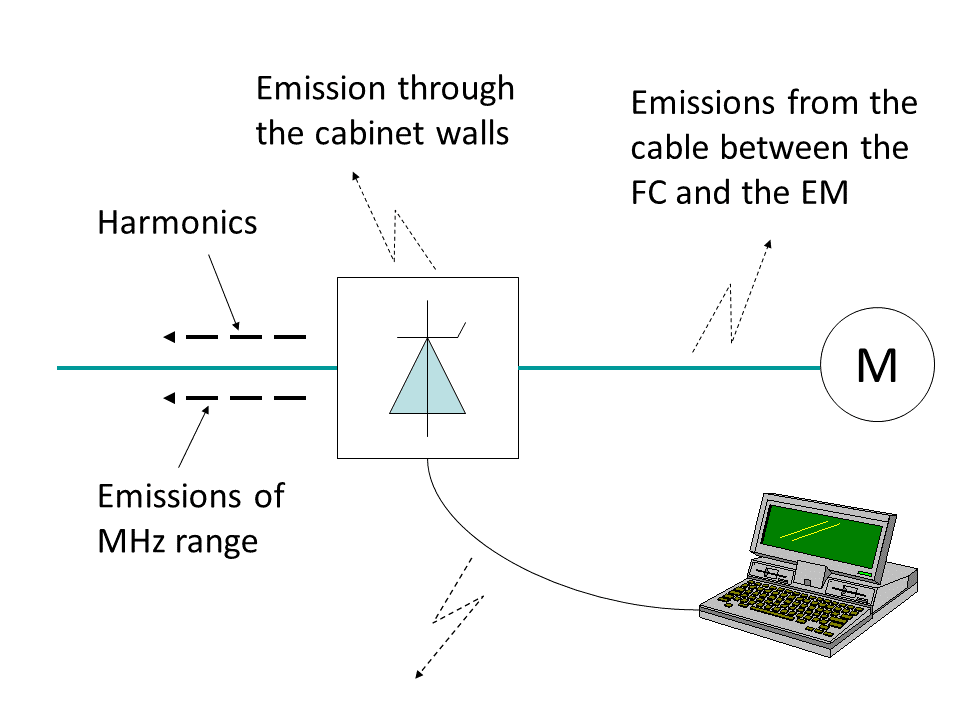

_Fig. 1. Emissions from the drive system_.

### Harmonics created by the frequency converter

The frequency converter is a non-linear load for the supply network and the
current and the voltage at FC input are not sinusoidal. Fig. 2 shows typical
forms of current and voltage at the input of the 400 V, 75 kW FC with an
uncontrolled 6-pulse rectifier. The current wave is usually distorted much more
than the voltage.

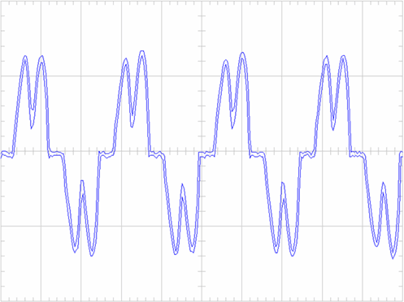 _(a)_

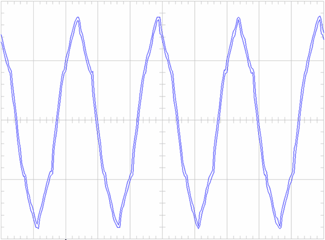 _(b)_

_Fig. 2. Waveforms of current (a) and voltage (b)_.

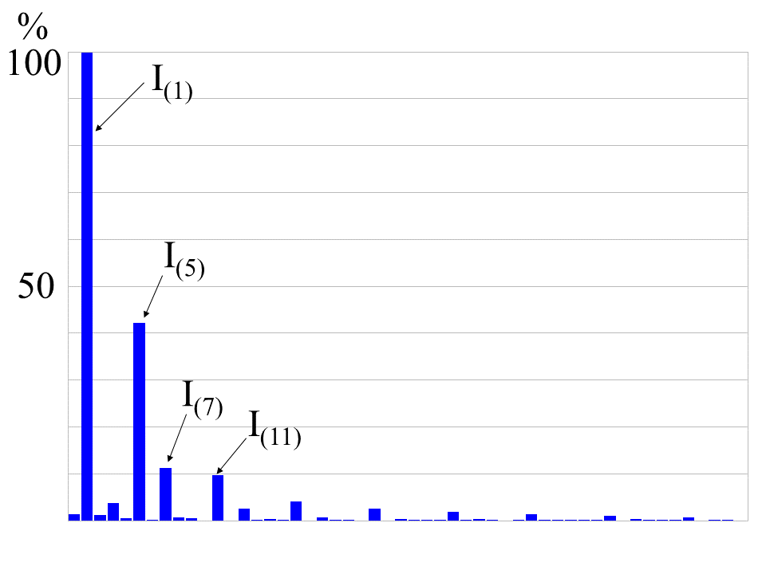 _(a)_

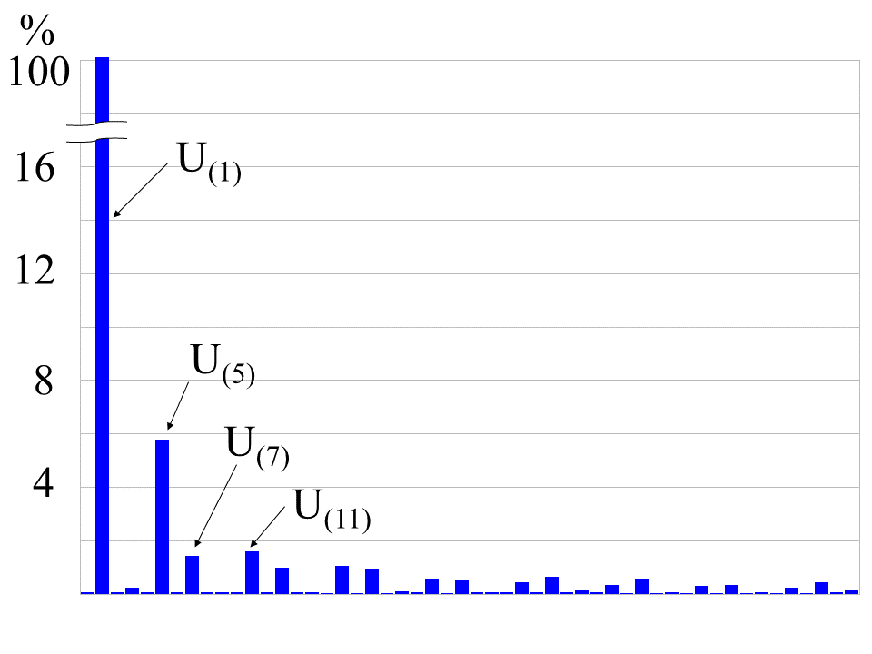 _(b)_

_Fig. 3. Fourier transformation of current (a) and voltage (b)_.

### Measures of current and voltage distortion

The common measure of the harmonic distortion of the current wave is "total
harmonic distortion (current)" - THD(i):

```math
K_I=\sqrt  \frac{\sum_{i\neq0} I_n^2 }{I_1^2}
```

A similar factor is used for voltage - THD(u):

```math
K_U=\sqrt  \frac{\sum_{i\neq0} U_n^2 }{U_1^2}
```

For example, for the waveform in Fig.2 the values of $$K_I$$ and $$K_U$$ are
40.2% and 6.6%, respectively. Sometimes in the expressions for the sinusoidal
distortion coefficients in the denominator the non-effective value of the first
harmonic ($$U_1$$ or $$I_1$$), but r.m.s. value ($$U$$ or $$I$$).

### Negative effects of harmonics

- Equipment misoperation and failure
- e.g. failure due to overheating of transformers, motors and cables, failure of
  capacitors because of resonance, failure due to insulation deterioration.
- Inconsistent meter reading
- Need for oversizing neutrals, transformers, generators
- Extra losses/Inefficiencies/power factor penalties

### What defines how strong the distortion is

Level of distortion is defined by the topology of the FC and the used filters
(if any) as well as stiffness of the grid. To define the "stiffness" of the
supply grid, the short-circuit current $$I_c$$ is calculated by hypothetically
placing short-circuit at the supply terminals. The stiffness of the supply must
be calculated in relation to the load current, therefore, the stiffness is
defined by a ration called short-circuit ratio (SCR): $$SCR=Ic_/I_L$$, where
$$I_L$$ - fundamental frequency component of the load current.

The stiffer the grid will be (the higher the SCR) the more harmonics the FC is
usually allowed to inject into the grid.

Influence of the topology and the filters is presented in a few diagrams below.
Standard uncontrolled 6-pulse rectifier with a choke as the input filter
(Fig.4,a) produced quite a lot of current distortion (Fig.4,b).

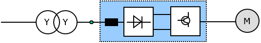 _(a)_

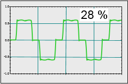 _(b)_

_Fig. 4. 6-pulse rectifier with a choke; system topology (a) and current
waveform with THD(i)=28% (b)._

12-pulse scheme with 3-winding transformer (Fig.5,a) reduces harmonics injected
into the grid (Fig. 5,b) compared to 6-pulse scheme with 2-winding transformer.

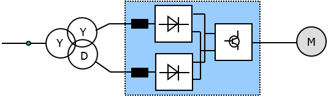 _(a)_

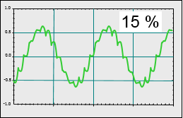 _(b)_

_Fig. 5. Topology of the 12-pulse system (a) and current waveform with
THD(i)=15% (b)_.

AFE converter provides lowest THD(i) (Fig. 6,b) but a bit higher THD(u) than
12-pulse scheme.

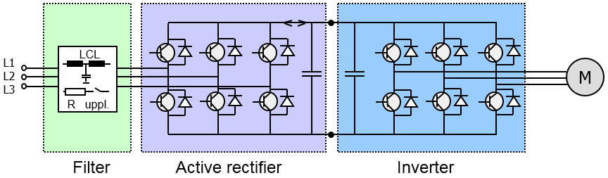 _(a)_

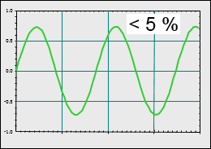 _(b)_

_Fig. 6. AFE converter with LCL filter (a) and the current waveform with
THD(i)=5% (b)_.
