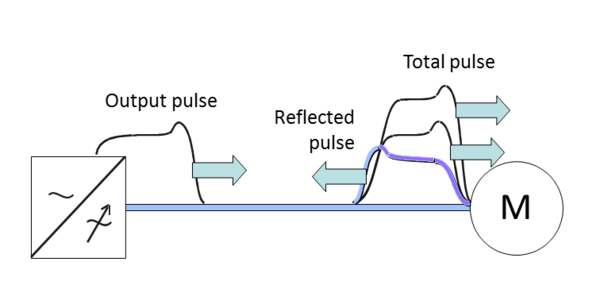
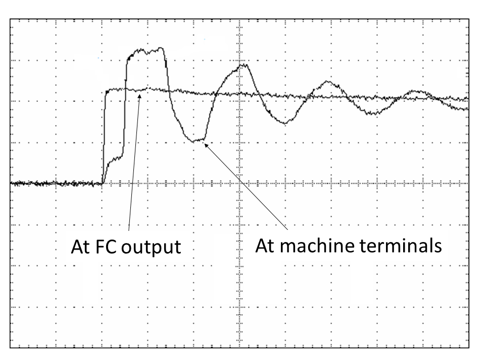
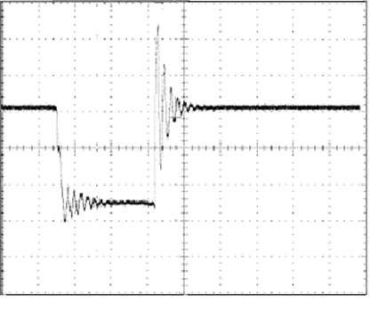
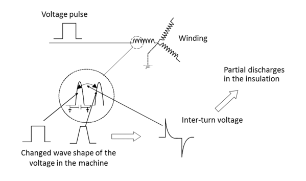
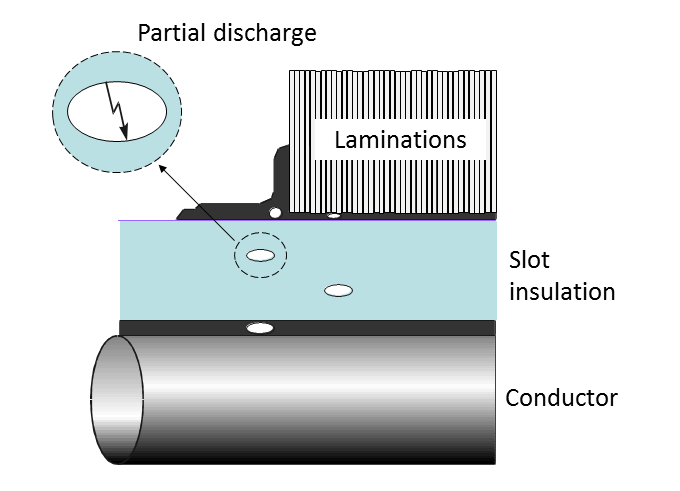
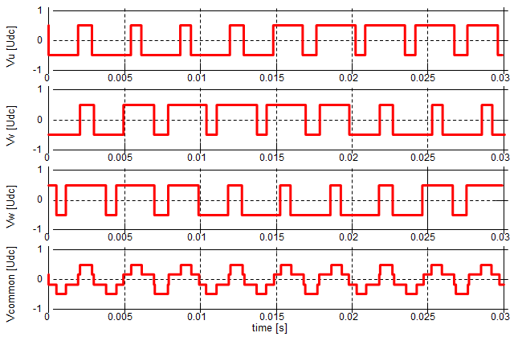
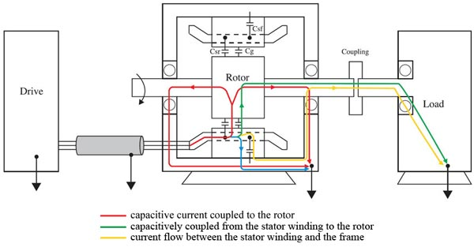

### High frequency effects

Voltage rise time of IGBT can be within 0.1-0.2 microseconds. When powering the
FC from the 400 V mains, the voltage in the DC link is about 540 V, so the rate
of voltage rise in the IGBT can be up to 5 kV/$$\mu$$s. Influence of the
sequence of pulse fronts with du/dt of 5 kV/$$\mu$$ on the system
"FC-cable-machine-reducer-driven mechanism" is in many ways similar to the
action of a sinusoidal voltage of the same amplitude, but with a frequency of
the order of several megahertz. That is why the negative effects caused by the
high switching are often called "high-frequency effects". The HF effects result
in:

- Increased losses in windings and core of the machine due to non-sinusoidal
  voltages and currents
- Ageing and degradation of insulation, shorter lifetime of the insulation
- Degradation of bearings

The effects affecting the insulation and the one affecting the bearings are
briefly presented below.

### Traveling waves and overvoltage

In practice, the length of the cable between the FC and the machine can reach
hundreds of meters and even up to a few kilometers. Due to the difference in
impedance of the cable $$Z_0$$ and the machines winding $$Z_m$$, voltage pulses
get reflected from both ends of the cable. As the result, there appear waves
travelling between the FC and the machine. At different instants of time, waves
can either compensate each other (when pulses have different polarity) or add up
(when polarity is the same). When the direct and reflected waves are combined,
as shown in Fig. 1, the total pulse at the terminals of the machine can reach
the value at which the insulation may break down.

_Fig. 1. Superposition of voltage pulses at the terminals of the machine_.

One way to estimate the peak voltage at the terminals of the machine with
allowance for wave superposition is
$$U_p=U_d\left(1+\frac{Z_m-Z_0}{Z_m+Z_0}\right)$$, where $$U_d$$ is the
amplitude of the voltage pulses at the converter output, equal to the voltage in
the DC link. When the cable gets longer, $$Z_0$$ decreases. In practice $$U_p$$
is within $$(1.5\ldots1.9)U_d$$.

Fig. 2,a shows the measured voltage at the output of the FC and at the terminals
of the machine (only part of the pulse is shown). For clarity, the impulses are
superimposed on each other. The effect of superposition of forward and backward
waves on the terminals of the machine resulting in voltage oscillations is
obvious.

 _(a)_

 _(b)_

_Fig. 2. Voltage pulses: the leading edge of the pulse at the output of the FC
and at the terminals of the machine (a), both edges of the pulse at the
terminals of the machine (b)_.

### du/dt-effect

Sharp edges/fronts of the PWM pulses and capacitances in the winding lead to
uneven voltage distribution inside the winding and create inter-turn voltage
spikes as shown in Fig 3,a. This leads to partial discharges in the insulation
(Fig.3,b). Constant partial discharges lead to aging of insulation and
subsequent destruction (breakdown).

 _(a)_

 _(b)_

_Fig. 3. du/dt-effect: origins (a) and consequences (b)_.

### Bearing currents

The PWM modulation of the output voltage leads to a common-mode (CM) voltage. In
Fig. 4 switching pattern is shown, and it can be observed how the common-mode
(CM) voltage is generated. This voltage is obtained by adding the three voltages
resulting from the three inverter legs. Having the DC-link mid-point as a
reference, the voltages Va, Vb and Vc can either be +Vdc/2 or -Vdc/2, where Vdc
is the DC-link voltage. As a result, depending on the state of the switches, the
common mode voltage can take one of the values $$\pm$$Vdc/2 and $$\pm$$Vdc/6.

_Fig. 4. Common-mode voltage_.

CM voltages lead to appearance of CM high-frequency currents flow through
complex circuits/paths some of which are presented in Fig.5. The HF currents
circulating through the bearings of the machine (called "bearing currents") can
lead to premature bearing failures. Another example of the negative impacts is
HF leakage currents through ground cables which can interfere with control
cables.

_Fig. 5. The paths for HF currents_.
