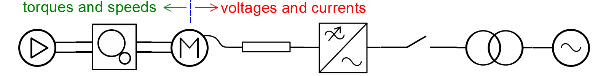
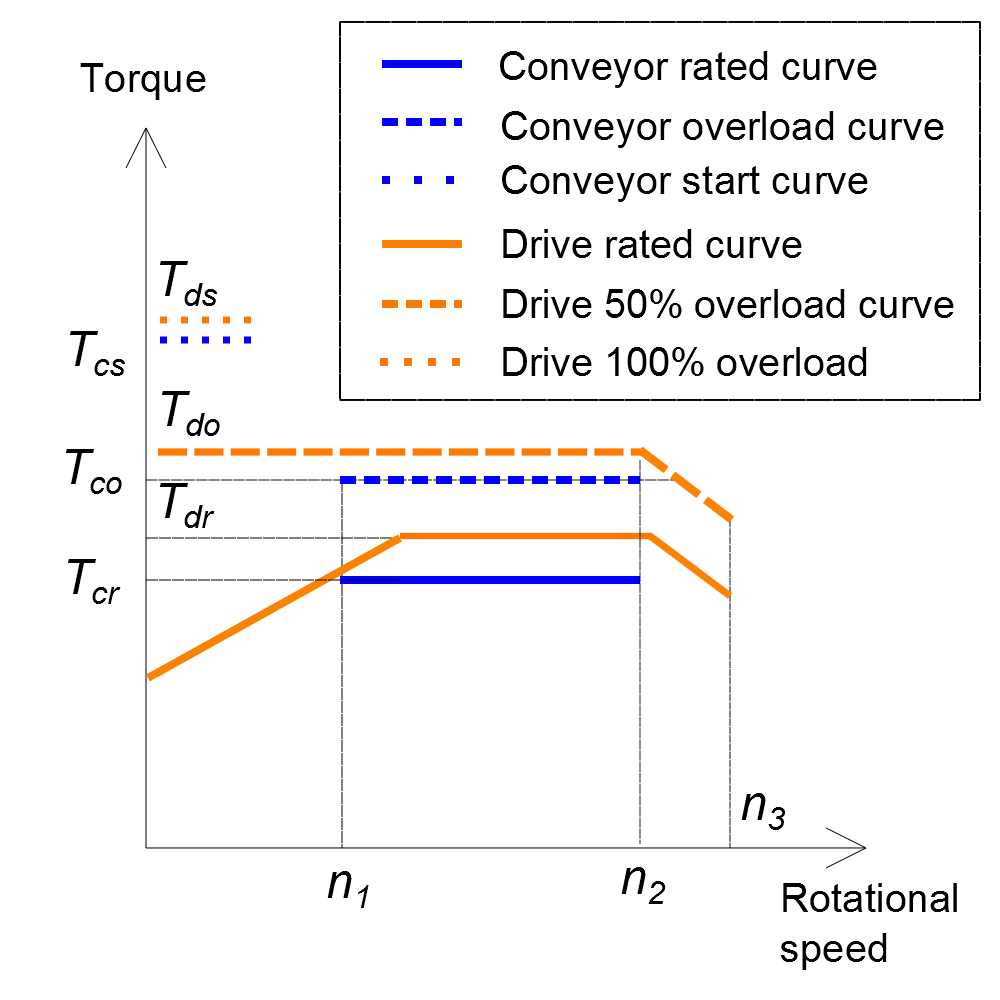
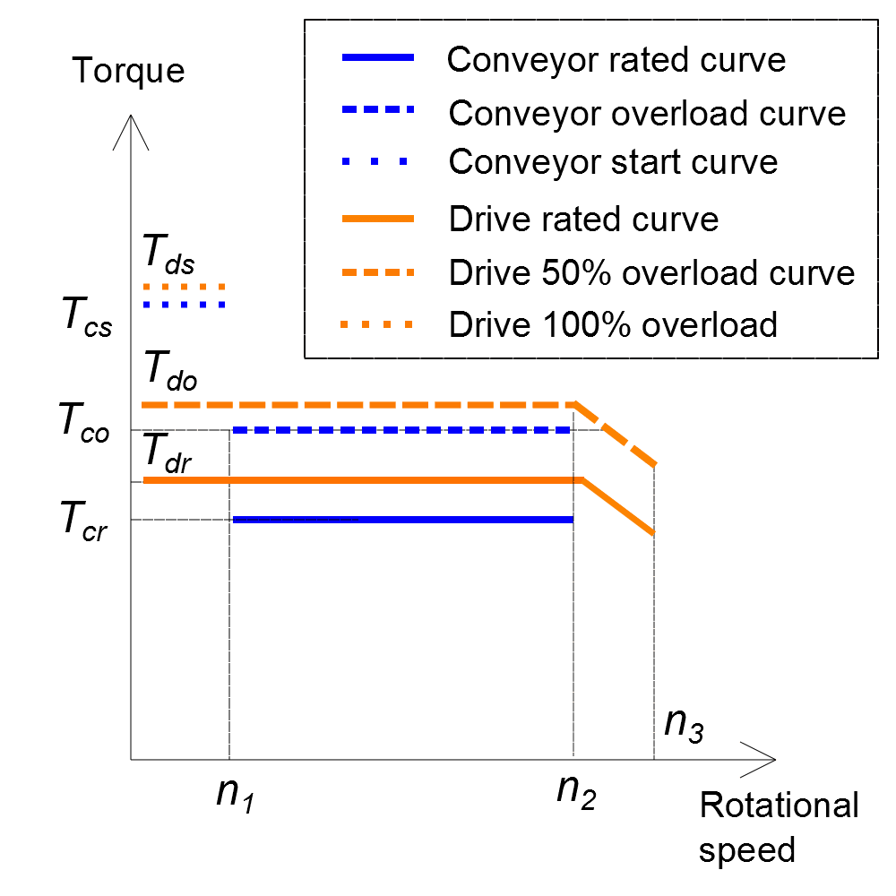

### Main principles of the component choice

Some parameters/features of the components, such as type or topology of the
component, its protection class, cooling methods, etc can be simply set by the
user. However, there are many parameters which cannot be set freely for many of
the components since the parameters are dependent on the parameters of other
components in the drive train.

Electric machine, being an electro-mechanical converter, must be selected based
on both mechanical parameters (torques and speeds) and electrical parameters
(voltages and currents) - see Fig.1.

 _Fig.1_.

For the system part between electric machine and the grid the components are
selected according to the electrical parameter - voltages and currents.

- For systems without transformers:
- electric machine's voltage and current must match voltage of the frequency
  converter
- frequency converter voltage must match voltage of the grid

 _Fig. 2_.

- For systems with transformer between the grid and the frequency converter:
- electric machine's voltage and current must match voltage and current of the
  frequency converter
- frequency converter voltage and current must match LV-side voltage and current
  of the transformer
- transformer HV-side voltage must match voltage of the grid

_Fig. 3_.

For the system part between the electric machine and the mechanism the
components are selected according to mechanical parameters - torques and speeds.

- For systems without gearbox:
- electric machine's torque and speed must match torque and speed of the
  mechanism

_Fig. 4_.

- For systems with gearbox:
- gearbox torque and speed must match torque and speed of the mechanism
- electric machine's torque and speed must match torque and speed of the gearbox

_Fig. 5_.

##### Matching the torques

All points of the drive system's rated torque curve should be higher than those
of the driven mechanism as shown in Fig. 6 for the different mechanisms; pump
(Fig. 6,a), wind turbine (Fig. 6,b), conveyor (Fig. 6,c,d) and winch (Fig.
6,e,f). Note than overload curves of the drive system should be above the
overload curves of the mechanisms.

_(a)_

_(b)_

_(c)_

_(d)_

_(e)_

_(f)_

_Fig. 6. System curves vs load curves for various mechanisms/application_.

When we consider the power-speed relationships the striking difference between
the constant-torque and fan-type load is underlined. If the motor is rated for
continuous operation at the full speed, it will be very lightly loaded
(typically around 20%) at half speed, whereas with the constant torque load the
power rating will be 50% at half speed.

##### Difference of the algorithms for motor mode and generator mode

In motor mode we start from the driven mechanism, e.g. pump or conveyor, define
its rated torque (which is load for the motor) and based on this data we choose
the motor. If there is a gearbox between the mechanism and the motor, then the
load torque at the motor shaft is calculated as [load torque]/[gear ratio]. In
generator mode we start from the grid side and go down to the generator and
gearbox, if any.
